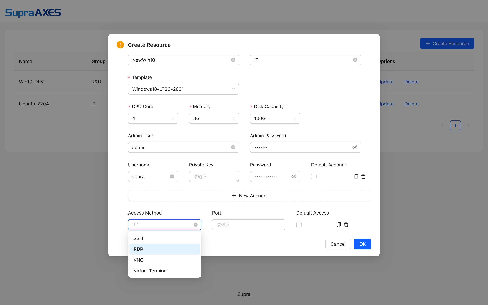

**SupraDaaS** is a next-generation Destop-as-a-Service (DaaS) solution based on Containerized VM ([SupraVM](https://github.com/supraaxes/supravm)). Leveraging cloud-native technologies, particularly containerization at the core, **SupraDaaS** effectively eliminates the intricacies and inefficiency in traditional VM management with DaaS or Virtual Desktop Infrastructure (VDI), and empowers a more scalable, resilient, and user-friendly infrastructure.

## Installation
```
sudo docker compose up
```

SupraDaaS is built with Service-Oriented Architecture (SOA) on docker, with mounts to the host for persistant storage (cofigurations, logs, icons.) and cross-service sharing (temp files for user uploads).

Users will access VMs all from Web portal on resource UI page (*https://SupraDaas-Address/*), and Administrators can manage VMs on the admin UI page (at *https://SupraDaas-Address/admin*).

<div style="display: flex; justify-content: space-between;">
  
  
</div>

### Mounts 
- **Settings, /opt/supra/daas/conf**: configuration files  
    1. *vmSettings.json*: settings for options to *CPU Core*, *Memory* and *Disk Capacity* on the admin UI page. 
        - *cpuSizes* for *CPU Core*, list of the number of cores
        - *memorySizes* for *Memory*, list of the amount of memory
        - *diskSizes* for *Disk Capacity*, list of the capacity of disk
    2. *rule.json*: settings for rules applied to users accessing VMs from the resource UI page.
        - *keyboard*, set to *1* allow users to input with keyboard. Default is not set to disallow users to input with keyboard.
        - *mouse*, set to *1* allow users to input with mouse. Default is not set to disallow users to input with mouse.
        - *copy*, set to *1* allow users to copy from the VM. Default is not set to disallow users to copy from the VM.
        - *paste*, set to *1* allow users to paste to the VM. Default is not set to disallow users to paste to the VM.
        - *download*, set to *1* allow users to download from the VM. Default is not set to disallow users to download from the VM. ONLY for RDP sessions.
        - *upload*, set to *1* allow users to upload to the VM. Default is not set to disallow users to upload to the VM. ONLY for RDP sessions.
        - *idleTime*, set the maximum idle time for users on the VM in number of minutes. Default is 15.
    3. *vm_backup_schedule.json*: settings for the schdule to automatically backup VMs.
        - *force_shutdown*: set to *true* to forcefully shutdown VMs before backup starts. Default is *false* to skip the backup task when the VM is running.
        - *weekly*: set the time to start the weekly VM backup task, *day* for the number of day, *hour* for the number of hour in the day, *minute* for the number of minute in the hour, *tz* for timezone from UTC. For example, *[{"day": 6, "hour": 20, "minute": 0, "tz": 0}]* is to start the weekly VM backup task on Saturday at 20:00:00 UTC.

- **Data** 
    1. */opt/supra/daas/vm/storage*: VM template and machine files 
    2. */opt/supra/daas/vm/backup*: VM backups  
    3. */opt/supra/daas/vm/host*: host specific files, e.g. container logs
    4. */opt/supra/daas/files*: VM brokerage files for RDP sessions
    5. */opt/supra/daas/db*: database files for VM resources and sessions
    6. */opt/supra/daas/cert*: certificate(tls.cert) and key(tls.key) for HTTPS. If not provided, a self-signed certificate and key will be automatically generated.
    7. */opt/supra/daas/logs*: log files

## Administration

### Templates 
VM templates MUST be placed into */opt/supra/daas/vm/storage/template/*, with *template-id* as the folder name. SupraDaaS will automatically check and update template information in 5 minites.

For each template, there MUST be two files: 
- *sys.qcow2* is the system disk file.
- *info.json* is to specify information about the template.
    1. *name*: set to the name of the template, shown on the admin UI page. MUST set to strings with *a-z*, *A-Z*, *0-9*, or *-* .
    2. *osType*: set to the OS type of the template. MUST set and valid option is *windows-xp*, *windows-7*, *windows-10*, *windows-11* or *windows-2003* for *windows* and *ubuntu-2204* for *linux*. Support to more OS versions is yet to come.
    3. *diskSize*: set to the capacity of the system disk. MUST set and match with the *sys.qcow2* file.
    4.*access*: set to list access methods to the template system with *sys.qcow2*, each specifying the *protocol* and *port*.
        ```
        To allow users to access a VM created from the template system with *sys.qcow2*, the VM needs to enable remote access service accordingly. Currently supported *protocol* is *rdp*, *ssh* or *vnc*.
        ```
    5. *management*: set to the management interface on the template system with *sys.qcow2* and all VMs created from it, specifying the *protocol*, *port* and *interval* in seconds.
        ```
        To use the management interface, all VMs created from the template system with *sys.qcow2* need to enable remote management service (*winrm* on Port *3985* for *windows* or *ssh* on *3985* for *linux*).
        ```
    6. *adminName*: set to the account name used for the the management interface on the template system with *sys.qcow2*. MUST set to the if the management interface is available.
    7. adminPasswd":set to the password for the account name used for the the management interface on the template system with *sys.qcow2*. MUST set to the if the management interface is available.
    8. *userMgr*": set to *1* to enable user management for VMs created from the template system with *sys.qcow2*. Default is not set for disabling user management.
    9. users": set to the list of default users available on VMs generated from the template system with *sys.qcow2*, specifying the *user* (name of a local user) and *pass* (password for the local user).

### User Access
Users can access all VMs directly from Web portal on resource UI page. Multiple access methods can be configured for a VM, and if there is no access method checked as the *Default Access*, the user will need to select one before connecting.

For a user to access a VM, the VM needs to enable the remote access service accordingly, and *rdp*, *ssh* and *vnc* are currently supported. In additiona, *Virtual Terminal* is provided as the access method to redirect the VGA display of a VM.

When a user clicks the icon of a VM resource on the resource UI page, selecting an access method if there are multiple ones set without specifiying the *Default Access* and fill in *username* and *password* if needed, a new tab in the browser will be openned for the access session. 

### Accounts Management
For VMs created from templates with valid management interface, accounts for user access can be configured on the admin UI page. Multiple accounts can be configured for a VM, and if there is no account checked as the *Default Account*, the user will be asked to fill in the *username* and *password* to use before connecting.

## Modules/Images
- daas-portal: web front end on https, with Nginx.
- daas-admin: app admin server, with Java.
- supra-db: database for template and VMs, with PostgreSQL.
- vm-manager: manage VM files and functionalities, with Python.
- supra-agent: [guacamole-server](https://github.com/apache/guacamole-server) for remote connections to VMs. 
- projector-supra-vm: customized containerized VM image, based on [SupraVM](https://github.com/supraaxes/supravm).

